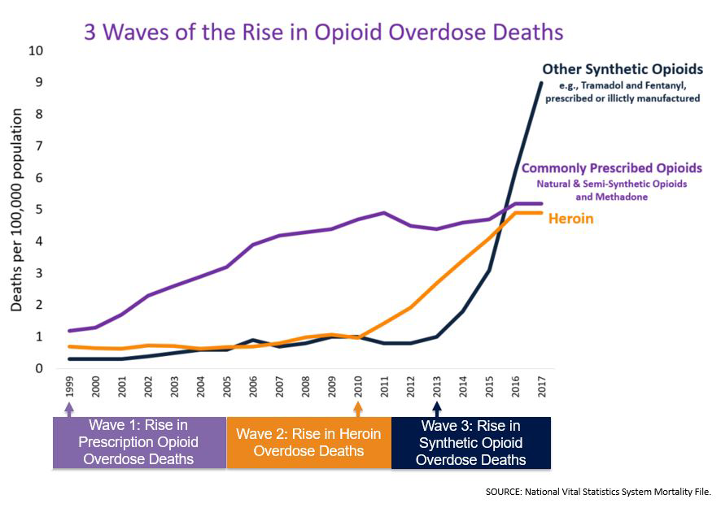
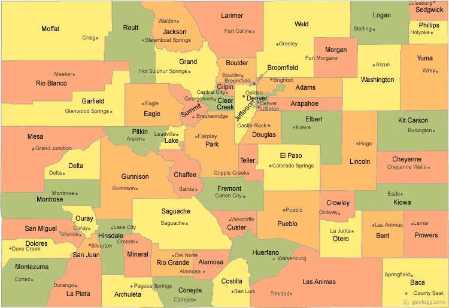
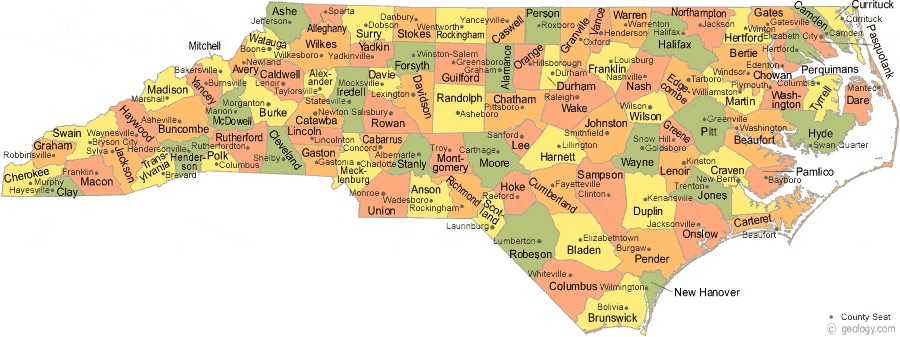

## Background {#background .unnumbered}

Over the past two decades, the United States has seen a tremendous
increase in the use and abuse of prescription opioids, leading not only
to a huge rise in opioid addiction, but also a rise in prescription
overdose deaths, and increasing deaths from non-prescription opioids
like heroin and fentanyl as people who became addicted to opioids due to
prescriptions turn to illegal markets to sustain their addiction.

<figure>

 
Source: US Centers for Disease Control

<figcaption>Opioid Epidemic</figcaption>
</figure>

In this project, we'll be **estimating the effectiveness of policy
interventions** designed to limit the over-prescription of opioids. More
specifically, we will attempt to measure the **effect** of a series of
policy changes designed to limit opioid abuse in several US states on
(a) opioid drug prescriptions, and (b) mortality from drug
overdoses.[^1]

Our interest in examining mortality as well as opioid prescriptions
comes from the fact that while restricting access to opioids may reduce
the likelihood that *future* patients will end up addicted to opioids,
it may drive already addicted patients to turn to alternative forms of
opioids, be those illegally purchased prescription drugs, heroin, or
fentanyl. This possibility is deeply troubling because the likelihood of
overdosing on these illegal drugs is *much* higher than on (monitored)
prescription drugs, as it is impossible for drug users to know the
strength of illegal drugs, and because drugs like fentanyl are so potent
that as little as 3mg can be lethal.

While our substantive focus is on opioid prescribing regulations,
however, it is worth noting that in many ways you can see this as a
template for policy evaluations more broadly. This is a specific
application of an approach to measuring the impact of a policy, not a
novel approach to analyzing opioid regulation.

## The Question {#the-question .unnumbered}

The goal of this project is to answer the following question: what is
the effect of opioid drug prescription regulations on

1.  the volume of opioids prescribed, and

2.  drug overdose deaths.

## What An Answer Looks Like {#what-an-answer-looks-like .unnumbered}

In developing a data science project, it is good practice to *start* by
asking what an answer to your question will look like. Once you know
what you are trying to achieve, you can then work backward to figure out
what data will be needed to answer the question, what data manipulations
will be required, and how you can divide those tasks among teammates.

In this case, the question we are asking is a *causal question*, meaning
that we are interested in understanding the *effect* of one thing on
another (i.e. what is the *effect* of X on Y), not just the correlation
between two variables.

In a magical, idealized world, the way we would answer a causal question
is to create two worlds: one in which our causal factor (here, a
specific policy change) takes place, and one where it does not. Then we
can say "How did things turn out differently for Florida in 2010 (one of
our cases) in the world with the policy change *as compared to the world
where no policy change took place in Florida in 2010?*"

In the real world, however, we can never actually see both a world with
the policy change and a world without the policy change *for the same
unit of observation at the same moment in time*. In the language of
causal inference, we can never directly observe our *counter factual*
(Florida *without* a policy change in 2010) -- we only get to see
Florida with the policy change in 2010.[^2]

With that in mind, we have to find a way to *estimate* what we think
*would* have happened in Floria had there been no policy change. And
this, in a nutshell, is the art of causal inference.

There are many approaches to solving this problem. The one we're most
familiar with is randomized drug trials, where we randomly assign people
to either take a drug or not take a drug. In these designs, because
people are being randomly assigned to take the drug or not, by the law
of large numbers we expect the people who take the drug to be, *on
average*, the same as the people who don't take the drug. Because of
these, we infer that what happens to the people who aren't taking the
drug is, *on average*, what *would* have happened to the people do are
taking the drug had they not taken the drug. In other words, we think
that the non-drug-takers are a good counterfactual for the drug-takers.

(If this is making your head spin a little, don't worry -- this stuff is
hard, and this is only a *very* quick summary of causal inference. About
half of my Spring course will be focused on these ideas.)

But we can't use this strategy for measuring drug policy because we
can't randomly assign states to either implement or not implement opioid
control measures. With that in mind, we need to come up with different
ways of estimating what we think would have happened to Florida had it
not passed opioid control measures.

### Pre-Post Comparison {#pre-post-comparison .unnumbered}

One of the most basic strategies, and the one we'll use first, is to
compare how things were in Florida right before the policy went into
effect to Florida right after the policy went into effect. In doing so,
we're assuming that had the opioid policy not gone into effect, Florida
in 2011 would have looked more or less like it looked in 2009.

This type of analysis would likely come out with a result that looks
something like the plots shown in
Figure [2](#figure_prepost_examples){reference-type="ref"
reference="figure_prepost_examples"}, where one plot is shown for what a
potentially successful policy might look like, and one plot is shown for
what an unsuccessful policy might look like.

<figure id="figure_prepost_examples">

<embed src="images/prepost_successful.pdf"
style="width:50.0%" /><embed src="images/prepost_failed.pdf"
style="width:50.0%" />

<figcaption>Pre-Post Model Figures</figcaption>
</figure>

### Difference-in-Difference {#difference-in-difference .unnumbered}

A simple pre-post comparison is a good, simple approach to causal
inference, but it is not without its problems.

Suppose, for example, that around 2010 (the same time Florida's policy
went into effect) the US Customs Service managed to dramatically reduce
the importation of fentanyl into the United States. This would likely
reduce the number of overdose deaths throughout the United States, and
so if we were just comparing Florida in 2009 to Florida in 2011, we
would see a decline in overdose deaths and wrongly attribute that to
Florida's policy change.

One strategy for dealing with this is what's called a
*difference-in-difference* approach. In simple terms, we don't just
compare Florida in 2009 to Florida in 2011; instead, we ask "were there
bigger changes in overdose deaths in Florida between 2009 and 2011 *than
in other states that didn't change their opioid policy*?" If Florida's
policy had an effect, then we would expect opioid overdoses in Florida
to decrease differently than overdoses in states without a policy
change. But if Florida experienced a decline in overdoses because of
something that happened nationally (e.g. if US Customs blocked opioid
importation), then we'd expect to see overdoses reduce at the same rate
in all states.

In other words, if we see a decline in Florida overdoses, we want to
know whether the change we saw in Florida (the "difference" from
pre-to-post) is larger than the change that occurred in other states
over the same period? Or, to map this onto the term
"difference-in-difference," if we estimate the *difference* between 2009
and 2011 separately for Florida and states without policy changes, is
there a difference in those differences?

This type of analysis would likely come out with a result that looks
something like the plots shown in
Figure [3](#figure_diffindiff_examples){reference-type="ref"
reference="figure_diffindiff_examples"}, where one plot is shown for
what a potentially successful policy might look like, and one plot is
shown for what an unsuccessful policy might look like.

<figure id="figure_diffindiff_examples">

<embed src="images/diffindiff_successful.pdf"
style="width:50.0%" /><embed src="images/diffindiff_failed.pdf"
style="width:50.0%" />

<figcaption>Difference-in-Difference Example Plots</figcaption>
</figure>

In addition to making this kind of plot, a difference-in-difference can
also be estimated statistically using a linear regression model, as
detailed in Appendix [1](#appendix_diffindiff){reference-type="ref"
reference="appendix_diffindiff"}. **NOTE THAT IN YOUR REPORT YOUR PLOTS
SHOULD INCLUDE STANDARD ERROR BANDS!**

To be clear, difference-in-differences aren't *always* valid. The
assumption of a difference-in-difference design is that while our
policy-change state (Florida) doesn't have to be the same as our
non-policy-change states (everyone else) in *levels*, the two groups do
have to exhibit similar *trends* before the policy change being studied.
Otherwise, the difference-in-difference may be large even if there's no
policy change.

{#figure_diffindiff_nonparallel
width="70%"}

To illustrate, consider
Figure [4](#figure_diffindiff_nonparallel){reference-type="ref"
reference="figure_diffindiff_nonparallel"}, which illustrates a case
where the two groups clearly don't have parallel trends in the
pre-policy change period. If we estimated a diff-in-diff anyway, the
difference from before to after for the policy change counties would be
negative, and the difference from before to after for the non-policy
change states would be positive, so the difference-in-difference
estimate would be very negative, suggesting a big policy impact.

But looking at the picture, it seems what probably happened is that the
states were just on different trajectories to begin with, and the policy
change likely had no effect. You don't need to worry about this too much
in this exercise -- as I've said, the analysis isn't the focus of this
project *per se*, but it's something to be aware of.[^3]

If the two groups have different trends, then we would expect
differences between the treated state and the untreated states after the
policy change even if there were no impact of the policy change just
because these states were already headed in different directions. This
is what is referred to as the parallel trends assumption. As you can see
in Figure [3](#figure_diffindiff_examples){reference-type="ref"
reference="figure_diffindiff_examples"} above, those model graphs show
parallel trends before policy implementation, and that is what we'd like
to see.

## Data {#data .unnumbered}

Two sources of data you will definitely need for this analysis are
information on (a) opioid prescriptions, and (b) drug overdose
mortality. Sources for this data are provided below. You will also
likely need at least one other source of data, which you will be
required to find on your own.

### Opioid Prescriptions {#opioid-prescriptions .unnumbered}

A core component of this project will be a recently released dataset of
all prescription opioid drug shipments in the United States from 2006 to
2019. This was only recently released (in 2020) by the *Washington
Post*, which obtained the data through a Freedom of Information Act
(FOIA) request to the US Drug Enforcement Agency.

-   [Read about data
    here.](https://www.washingtonpost.com/graphics/2019/investigations/dea-pain-pill-database/)

-   [Download here. Please use the *Click here to download the national
    data from The Washington Post* link in the fourth bullet point under
    "How to download this data" to get the most updated
    data.](https://www.washingtonpost.com/national/2019/07/18/how-download-use-dea-pain-pills-database/?arc404=true)

-   [More about variables in the data
    here.](https://github.com/wpinvestigative/arcos-api/blob/master/data/data_dictionary.csv)

### Vital Statistics Mortality Data {#vital-statistics-mortality-data .unnumbered}

The best national source of data on drug overdoses is the US Vital
Statistics records, which include data on every death in the United
States. Because their interface is a *pain* (e.g. you can only pull
75,000 records at a time, and picking the right variables to download is
really annoying), I've pre-downloaded their summary of mortality for
drug and non-drug-related causes for every US county from 2003-2015 for
your use. [You can download that data
here.](https://www.dropbox.com/s/kad4dwebr88l3ud/US_VitalStatistics.zip?dl=0)

Several notes about this data:

-   I've made a couple of small changes to this data, but they are very
    small. This is the raw data (in the format originally provided) by
    the US Vital Statistics system. So beware of formatting and
    cleanliness issues.

-   For privacy, the US Vital Statistics Agency censors some data. If
    the number of people in a given category (i.e. one county / year /
    cause of death category) is less than 10, that data does *not*
    appear in the data. Similarly, zero counts are also not reported. So
    if a county has only 2 deaths in a given year, that county just
    doesn't appear in the data for a given year. And if a county has 20
    deaths unrelated to drugs or alcohol, but 7 deaths due to overdose,
    the former statistic will appear in the data, but not the latter.

    -   It is for this reason that we will use *annual* data on
        mortality -- by summing deaths over full years, fewer counties
        end up near below this 10-death threshold, so the data is more
        complete.

-   You **WILL** need to develop a strategy for dealing with these
    missing values. A few things you *shouldn't* do:

    -   Fill them in with 10s. Most of these are small counties (that's
        why the absolute number tends to be low), so if you fill them by
        10s despite knowing the true value is less than 10, when
        normalized by population you will find that the overdose *rates*
        for these counties are insanely high and will dramatically skew
        your results.

    -   Fill them in with 0s. While the numbers probably tend to be
        closer to 0 than 10, they also almost surely aren't 0 either, so
        you're just making up numbers.

    -   Fill them with average mortality counts. If you fill them with
        average mortality counts, by definition you'll be filling them
        with counts that are greater than 10 (see above). And you know
        they're less than 10.

## Unit of Observation {#unit-of-observation .unnumbered}

A big part of any data science project is figuring out your *unit of
observation.* Your choice of unit of observation is dictated not just by
what is theoretically appropriate, but also by what is feasible given
the data available. You may *want* to study a question with
individual-level data, but if you can only get data that is aggregated
at the level of cities, you don't have the option of working at the
individual level.

As many students doing this project are not Americans and so are
unlikely to be familiar with US administrative districting, I will spare
you the challenge of figuring out the right geographic unit of analysis
for this project: the geographic unit of analysis we'll be working are
counties, and our temporal unit of analysis will be years (so expect to
have one observation per county per year in your final analysis).

Counties are administrative units in the US that fall entirely *within*
states, but can otherwise vary in every way. In some states, like North
Carolina, counties are relatively similar in geographic size (as shown
in Figure [5](#counties){reference-type="ref" reference="counties"}
below), but they often vary radically in population (in North Carolina,
county populations vary from over 1 million people (Mecklenburg and Wade
Counties) to well under 10,000 (Hyde and Tyrrell Counties)). In other
states, like Colorado (also pictured below), some counties (like Denver,
a little above and to the right of the center of the state) are much
smaller than other counties geographically.

<figure id="counties">

 
Colorado North Carolina

<figcaption>US County Maps</figcaption>
</figure>

While they are kind of odd in terms of their heterogeneity, however,
they are common units of analysis for US government data because they
are more granular than states, but also big enough that reporting the
number of deaths from drug overdoses in a given county doesn't threaten
the privacy of individuals. Indeed, in this analysis, we will find that
all our data is available at *at least* the county level.

Things to know about counties:

-   There are about 3,200 counties in the United States.

-   Counties vary dramatically in population and geographic size

-   County names are *not* unique across states. The same county name
    will appear in many states.

-   Counties are sometimes called other things, like "parish" (in
    Louisiana), or occasionally "borough".

-   All US counties and states have assigned numeric identifiers called
    "FIPS codes." Not all datasets will include the county's FIPS codes,
    but if you can find them, they're much easier to use than county
    names since you don't have to worry about capitalization and such.
    You can find datasets online easily that will tell you the FIPS code
    for a given county given its state and name.

    -   County FIPS codes are often represented as the concatenation of
        a 2-digit State FIPS code and a 3-digit County FIPS Code. So if
        you are in the County of Autauga (County 1) in Alabama (State
        1), you could see a county FIPS code of 01001, or you might see
        it broken out into a State FIPS code of 1, and a County FIPS
        code of 1. Sorry, just how it happens. :)

-   Just drop the state of Alaska (AK) from your analysis. It has some
    weird things going on with its county designations moving from
    before 2010 to after 2010, and they aren't worth dealing with.

## Policy Changes {#policy-changes .unnumbered}

In this analysis, we'll be analyzing *three* policy changes:

-   Florida, Effective February, 2010

    -   **Changes:** "Florida gained notoriety after 2007 because of the
        proliferation of pain clinics in the state that were prescribing
        large quantities of drugs for pain with little medical
        justification and were being used primarily by persons abusing
        or diverting opioid analgesics, benzodiazepines, and muscle
        relaxants. In 2010, Florida was also home to 98 of the 100 U. S.
        physicians who dispensed the highest quantities of oxycodone
        directly from their offices. In response, Florida enacted
        several measures to address prescribing that was inconsistent
        with best practices. The Florida legislature required that pain
        clinics treating pain with controlled substances register with
        the state by January 4, 2010. In February 2010, the Drug
        Enforcement Administration and various Florida law enforcement
        agencies began to work together in Operation Pill Nation. Pain
        clinic regulations were further expanded later in 2010. In
        February 2011, law enforcement conducted statewide raids,
        resulting in numerous arrests, seizures of assets, and pain
        clinic closures. In July of that year, coinciding with a public
        health emergency declaration by the Florida Surgeon General, the
        state legislature prohibited physician dispensing of schedule II
        or III drugs from their offices and activated regional strike
        forces to address the emergency. Mandatory dispenser reporting
        to the newly established prescription drug monitoring program
        began in September 2011. Finally, in 2012, the legislature
        expanded regulation of wholesale drug distributors and created
        the Statewide Task Force on Prescription Drug Abuse and
        Newborns."[^4]

    -   **Note:** Obviously what we have here is a *series* of changes
        rather than one single large change. Nevertheless, this analysis
        just operationalize the policy change as having taken place in
        February 2010.

-   Texas, Effective January 4, 2007

    -   **Changes:** "In 2007, the Texas Medical Board adopted
        regulations with regard to treating pain with controlled
        substances. The guidelines include performing a patient
        evaluation before prescribing opioids (including reviewing
        prescription data and history related to the patient contained
        in the state's prescription drug monitoring program (PDMP)),
        obtaining informed consent from the patient for opioid
        treatment, conduct periodic review of the opioid treatment, and
        maintain a complete medical record of the patient's
        treatment."[^5]. [Link to
        law.](https://texreg.sos.state.tx.us/public/readtac$ext.TacPage?sl=R&app=9&p_dir=&p_rloc=&p_tloc=&p_ploc=&pg=1&p_tac=&ti=22&pt=9&ch=170&rl=3)

-   Washington (the State, not Washington, DC), Effective Jan 2, 2012.

    -   **Changes:** In 2011, the Washington Department of Health
        adopted a rule regulating the prescribing of opioids for pain
        treatment. Some of the prescribing requirements include:[^6]

        -   For patients who are stable involving non-escalating daily
            doses of 40 mg MED/day or less, periodic reviews shall take
            place annually.

        -   Mandatory consultation threshold for adults is 120 mg
            MED/day (oral).

        -   In the event a physician prescribes a dosage that meets or
            exceeds the consultation threshold, a consultation with a
            pain management specialist is required.

        -   The physician shall document each mandatory consultation.

        -   Recommended that a practitioner not prescribe more than an
            average MED of 120 mg without either the patient
            demonstrating improvement in function or without first
            obtaining a consultation from a pain management expert.

    -   [Link to
        regulation.](http://apps.leg.wa.gov/documents/laws/wsr/2011/12/11-12-025.htm)

## Your Task {#your-task .unnumbered}

Your task is to complete both:

-   a pre-post analysis, and

-   a difference-in-difference analysis

for all three of these policy changes. You can present your results in
the graphical format modeled above. While there are many statistical
methods of doing things like adding controls for various observable
factors, the emphasis of this analysis is on data wrangling and
transparent analysis, so those plots will be sufficient.

For the Florida and Washington cases, you must analyze the effect of its
policy change on *BOTH* opioid shipments and overdose deaths.

For Texas, you only need to analyze overdose deaths. This is because our
opioid shipment data only runs from 2006, meaning that you only have one
year of data on either side of the policy change, making evaluation of
trends difficult. The overdose data I have provided, by contrast, runs
from 2003-2015. With that said, *any group that would like to analyze
opioid shipment data *by month* instead of by year for Texas (which
would get you 12 observations with which to measure trends) would get
extra credit for their project.*

For this project, you must:

-   Gather all data needed to complete this analysis

-   Clean, organize, and merge it in order to allow for the creation of
    the final analysis.

-   Do all your work transparently through github *as a team*.

    -   All team members must make substantial commits to the project.

    -   All team members must also actively review at least one PR for
        another team member. **You will be graded on your own code
        review. *Your* code review is where YOU review the code of
        someone else, not where you have your code reviewed!**

-   Present **TWO** final reports, one for me, one for an imaginary
    policy maker (who is *not* a statistician).

-   In the report for me, include:

    -   The motivation for the project,

    -   The motivation for the research design being used,

    -   Details of the data used and how different datasets have been
        related to one another,

    -   Summary statistics for your data,

    -   Your analysis,

    -   Your interpretation of that analysis.

-   In the report for a policymaker (someone who is NOT trained in
    statistics), include:

    -   The motivation for the project,

    -   Overview of the data being used,

    -   Your analysis (presented for a non-statistician),

    -   Your *interpretation* of that analysis (again, laying out
        strengths and weaknesses without using statistical jargon).

In writing your report, remember that much of the focus of this project
is on *data wrangling*, so spend lots of time on your data section for
me discussing where your data came from, what assumptions you've made in
working with it, and how you handled issues you ran into.

## Due Dates {#due-dates .unnumbered}

-   An outline of your project strategy is due on November 7th.

    -   In writing this strategy, use a "backwards design"
        organizational scheme: Start by establishing what you want to
        achieve (i.e. the plots I've already specified). Then ask: What
        dataset do I need to make these plots? Or more specifically:

        -   What variables will I need in this data?

        -   What sample (what years, what counties, etc.) needs to be
            covered in this data?

        -   What should a single row of this data look like (i.e. what's
            a unit of observation?)

    -   Then step back and repeat the process: to get this dataset, what
        do I need to do? What do I need my input datasets to look like
        to get to this final analysis dataset?

    -   Then again: to get to these intermediate datasets, what source
        datasets do I need? What variables do they need?

    -   Then start trying to assign the tasks implied by that analysis
        to people. (OBVIOUSLY this will only be very approximate!! But
        it's good to think about this before you start, then adapt as
        you move forward).

    This should include a summary of the datasets you plan to use, a
    summary of how you plan to merge these datasets, who will be
    responsible for writing initial code for each step, and who will
    review each set of code.

-   A preliminary draft of your report will be due November 22nd.

-   A final draft of your report will be due December 9th.

## Tips {#tips .unnumbered}

-   Keep your *source* datasets in a common Dropbox folder. You should
    *only* ever read data from your source data, not modify it directly.
    This is to ensure that your source files never get corrupted.
    Because of that, it's fine to have it live outside your github repo.

-   Store your intermediate files (the results of reading data from the
    source files and making modifications) in your repository using
    git-lfs. Store the files in `parquet` format to minimize memory use.

# Difference-in-difference Regressions {#appendix_diffindiff}

of the following form (where $c$ is an index for US Counties (a
geographic unit of observation within states), and $t$ is an index for
time):

*Allowing only for level changes:* $$\begin{aligned}
 Y_{c,t} &=& \alpha + \psi_{c} + \beta_1 post_{t} + \label{diff_in_diff_notime}\\
  && \beta_2 post_{t} * policy\_state_{c} + \epsilon_{c,t} \nonumber
\end{aligned}$$

Where $Y_{c,t}$ is a county-year-level outcome (either overdoses per
capita or opioid shipments), $\psi_c$ are county-fixed effects,
$post_{t}$ is an indicator for whether we are in a period after
implementation of the policy change, and $policy\_state_{c}$ is an
indicator for whether a given county is in a state that experienced a
policy change. Our "difference-in-difference" estimate is the
coefficient $\beta_2$.

However, note that the analysis in
Figure [3](#figure_diffindiff_examples){reference-type="ref"
reference="figure_diffindiff_examples"} allows for time trends, which do
not appear in this specification
[\[diff_in_diff_notime\]](#diff_in_diff_notime){reference-type="ref"
reference="diff_in_diff_notime"}. It just compares differences in
average levels of overdoses before and after the policy change. If we
also want to allow for differential time trends (as pictured above) we'd
use specification
[\[diff_in_diff_wtime\]](#diff_in_diff_wtime){reference-type="ref"
reference="diff_in_diff_wtime"}:

*Allowing for both changes in levels and for changes in trends
(analogous to what we plotted above):* $$\begin{aligned}
 Y_{c,t} &=& \alpha + \label{diff_in_diff_wtime}\\
 && \beta_1 policy\_state_{c} + \nonumber\\
 && \beta_2 year_{t} + \beta_3 year * policy\_state_{c} + \nonumber\\
 && \beta_4 post_{t} + \beta_5 post_{t} * policy\_state_{t} + \nonumber \\
 && \beta_6 post_{t} * year + \nonumber\\
 && \beta_7 post_{t} * year_{t} * policy\_state_{c} + \epsilon_{c,t} \nonumber
\end{aligned}$$

Where $year_{t}$ has been adjusted to take on a value of 0 at the year
of the policy change.

We can interpret these as follows, where for simplicity I'll just call
our policy-change state "Treated," and non-policy change states as
"Controls."

-   $\alpha$ is the intercept for the Controls in the pre-policy change
    period (note that the intercept occurs at the year of the policy
    chance since that's where $t=0$). $\alpha + \beta_{1}$ is the
    intercept for Treated in the pre-policy change period.

    -   Consequently, $\beta_1$ is the *difference* in intercepts at
        $t=0$ for the pre-policy change period.

-   $\alpha + \beta_4$ is the intercept for the Controls in the
    post-policy change period. $\alpha + \beta_1 + \beta_4 + \beta_5$ is
    the intercept for Treated in the post-policy change period.

    -   Consequently, $\beta_1 + \beta_5$ is the *difference* in
        intercepts at $t=0$ for the post-policy change period.

-   $\beta_2$ is the slope for Controls before the policy change.
    $\beta_2 + \beta_3$ is the slope for Treated before the policy
    change.

    -   Consequently, $\beta_{3}$ is the *difference* in slopes in the
        pre-policy change period.

-   $\beta_{2} + \beta_{6}$ is the slope in the post-policy change
    period for Control states.
    $\beta_{2} + \beta_{3} + \beta_{6} + \beta_{7}$ is the slope for
    Treated in the post-change period.

    -   Consequently, $\beta_{3} + \beta_{7}$ is the difference in
        slopes in the post-policy change period.

-   The *difference-in-difference* estimate for the change in intercepts
    is therefore:\
    $(\beta_1 + \beta_5) - (\beta_1) = \beta_5$

-   The *difference-in-difference* estimate for the change in slopes is
    therefore:\
    $(\beta_{3} + \beta_{7}) - (\beta_{3}) = \beta_7$.

So far so good! But we are often interested in asking about how things
look *on the whole* at some point after a policy has changed, not right
at the moment of the policy change.

This is also helpful in situations where level shifts go one way (say,
seems to make stuff worse), but the slope change goes the other (seems
to make stuff better). At what point do those offset? After 2 years, for
example, is everyone better off?

These quantities are quite tricky because you have to estimate them *at
a point in time*, which means bringing in specific values of $t$.
(Again: this is after we've normalized $year$ so that $t=0$ occurs at
the year of the policy change. )

Suppose, for example, we wanted to compare outcomes 2 years after the
policy to 1 year before the policy change. Here are the predicted values
(note how we now have to fill in values for $year$'):

-   Treated at 2 years after policy change:\
    $\alpha + \beta_1 + \beta_2 * 2 + \beta_3 * 2 + \beta_4 + \beta_5 + \beta_6 * 2 + \beta_7 * 2$

-   Control at 2 years after policy change:\
    $\alpha + \beta_2 * 2 + \beta_4 + \beta_6 * 2$

-   Treated 1 year before policy change:\
    $\alpha + \beta_1 + \beta_2 * -1 + \beta_3 * -1$

-   Control 1 year before policy change:\
    $\alpha + \beta_2 * -1$

Now differencing:

-   Difference (T - C) two years out:\
    $\beta_1  + \beta_3 * 2+ \beta_5 + \beta_7 * 2$

-   Difference (T-C) one year before:\
    $\beta_1  + \beta_3 * -1$

-   Difference-in-difference from two years after minus one year
    before:\
    $\beta_7 * 2 + \beta_5 + \beta_3$

Yeah\... see? That doesn't just drop out of the regression table, nor
does an estimate of significance. And that's why we use post-regression
tests!

## Fixed-Effects {#fixed-effects .unnumbered}

It is also normal to do the difference-in-difference regression
described above with fixed effects. Note, however, that this changes the
specification somewhat because $policy\_state_{c}$ is non-time-varying,
and so will be co-linear with county fixed effects, and so it won't be
possible to estimate it. That doesn't change the diff-in-diff estimates,
but it does make reading the equations a little trickier, so I did the
writeup above without fixed effects. In general, though, it's best to
use fixed effects when you can!

[^1]: In particular, we will focus on a Texas regulation that went into
    effect in January 2007, a Washington regulation that went into
    effect in January 2012, and a Florida regulation that went into
    effect in 2010.

[^2]: This is what is referred to as the Fundamental Problem of Causal
    Inference.

[^3]: Careful readers may note that there might be a way to take into
    account the different initial difference in trends. This is what's
    called a "difference-in-difference-in-difference" estimate, and
    *can* be useful, but it becomes increasingly dependent on you being
    able to precisely estimate trends and their functional forms, adding
    additional assumptions and generally requiring more data to test
    those assumptions.

[^4]: Source: Johnson, Paulozzi, Porucznik, Mack, and Herter, 2014.

[^5]: Source: The Network for Public Health Law, [Appendix
    B](https://azdhs.gov/documents/prevention/womens-childrens-health/injury-prevention/opioid-prevention/appendix-b-state-by-state-summary.pdf)

[^6]: Source: The Network for Public Health Law, [Appendix
    B](https://azdhs.gov/documents/prevention/womens-childrens-health/injury-prevention/opioid-prevention/appendix-b-state-by-state-summary.pdf)
